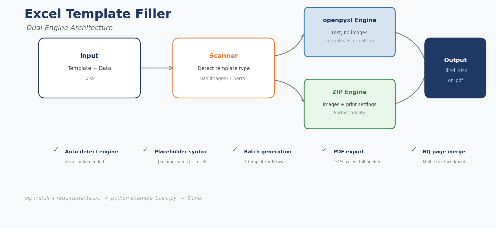

<p align="center">
  
  
  
  
</p>

# Excel Template Filler

> **Batch-fill Excel templates while preserving images, print settings, and formatting — things openpyxl alone can't do.**

Dual-engine batch template filler for Excel. Auto-detects the best engine (openpyxl for data-only, raw ZIP manipulation for templates with images/print settings). Built from real MEP construction workflows — one template × N data rows = N perfectly filled output files.

<p align="center">
  
</p>

---

## 🎯 The Problem

`openpyxl.copy_worksheet()` silently destroys images, charts, print settings, merged cells, and other binary resources. If your template has a logo or company header, batch-filling with openpyxl alone breaks it.

## 💡 The Solution

**Dual-engine architecture** — auto-selects the best engine for your template:

| Engine | Best For | Preserves |
|--------|----------|-----------|
| **openpyxl** | Data-only templates (fast) | Formulas, formatting |
| **ZIP** | Templates with images/print settings | Everything: images, headers, print areas, page breaks |

**Zero config.** The tool scans your template and picks the right engine automatically.

---

## 🚀 Quick Start

```bash
git clone https://github.com/David-CB666/excel-template-filler.git
cd excel-template-filler
pip install -r requirements.txt
```

### Fill a Template (3 lines)

```python
from src.template_filler import TemplateFiller

filler = TemplateFiller("template.xlsx", "data.xlsx")
filler.fill()  # Auto-detects engine, fills placeholders, saves
```

### Batch PDF Export

```python
from src.exporters.bq_merger import BQMerger

merger = BQMerger("master.xlsx", "data.xlsx")
merger.generate_sheets()  # Creates one sheet per row, exports to PDF
```

### CLI Mode

```bash
python src/template_filler.py --template template.xlsx --data data.xlsx
```

---

## 📁 Project Structure

```
excel-template-filler/
├── src/
│   ├── engines/               # openpyxl + ZIP engines
│   │   ├── base_engine.py
│   │   ├── openpyxl_engine.py
│   │   └── zip_engine.py      # Preserves images & print settings
│   ├── exporters/
│   │   └── bq_merger.py       # Multi-sheet + PDF export
│   ├── scanners/
│   ├── template_filler.py     # Main entry point
│   └── auto_linker.py         # Smart column linking
├── examples/
│   ├── example_basic.py
│   ├── example_batch_pdf.py
│   └── data/ + templates/
├── references/                # Full API docs
└── tests/
```

---

## 🔧 Features

- ✅ **Dual engine** — openpyxl (speed) + ZIP (perfect fidelity)
- ✅ **Auto-detection** — scans template, picks best engine
- ✅ **Placeholder syntax** — `{{column_name}}` in templates
- ✅ **Batch generation** — one template × N data rows = N output files
- ✅ **BQ page merging** — merge multiple sheets into a unified workbook
- ✅ **PDF export** — COM-based export with full print fidelity
- ✅ **Smart column linking** — auto-matches headers between template and data

---

## 📖 Full Documentation

- **API Reference**: [`references/api-usage.md`](references/api-usage.md)
- **Engine Deep-Dive**: [`references/engines.md`](references/engines.md)
- **BQ Merger Guide**: [`references/bq-merger.md`](references/bq-merger.md)

---

## 📊 Real-World Impact

> *"以前 30 份材料報批表要手動 Copy-Paste 搞 2~4 個鐘。而家寫個 config，一條 command 5 分鐘搞掂。錯漏仲少咗 90%。"* — Mike, MEP Project Manager

---

## 🇭🇰 中文簡介

雙引擎 Excel 模板批量填充工具。自動選擇最佳引擎（純數據模板用 openpyxl，含圖片/打印設定模板用 ZIP 原始操作），一張模板 × N 行數據 = N 份完美輸出的填表文件。建基於澳門真實工程實戰。

---

## 🔗 My Other Tools

| Tool | Description |
|------|-------------|
| [**GanttChart Pro**](https://github.com/David-CB666/gantt-chart-pro) | Professional Gantt charts in Excel — no MS Project |
| [**VBA Macro Reader**](https://github.com/David-CB666/VBA-Macro-Reader-v2.0.0) | Read, modify & execute VBA macros from .xlsm files |
| [**Material Submittal Generator**](https://github.com/David-CB666/material-submittal-generator) | One-click batch submittals + auto BQ page merging |

---

## 📄 License

MIT © [David-CB666](https://github.com/David-CB666)
