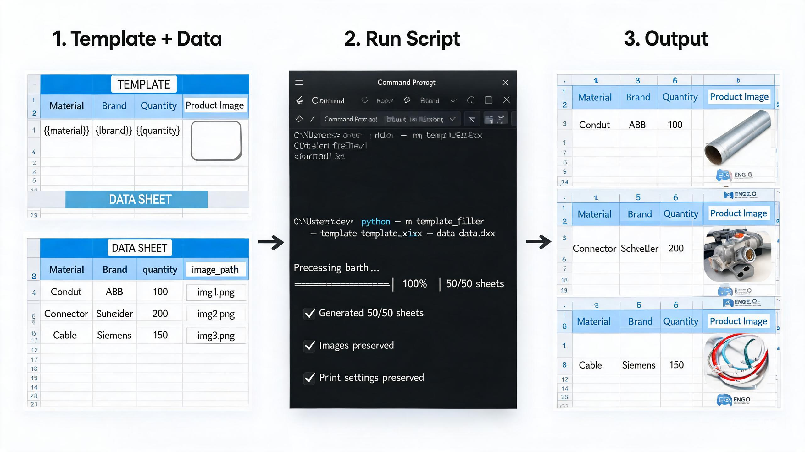

<div align="center">

# Excel Template Filler

### Batch-fill Excel templates while preserving images, print settings, and formatting — things openpyxl alone can't do.

Dual-engine batch template filler for Excel. Auto-detects the best engine (openpyxl for data-only, raw ZIP manipulation for templates with images/print settings). Built from real MEP construction workflows — one template × N data rows = N perfectly filled output files.

[](https://opensource.org/licenses/MIT)
[](https://python.org)
[](https://openpyxl.readthedocs.io)
[](https://github.com/David-CB666/excel-template-filler/stargazers)
[](https://github.com/David-CB666/excel-template-filler/network/members)
[](https://github.com/David-CB666/excel-template-filler/commits)

[Quick Start](#-quick-start) · [Features](#-features) · [Documentation](#-documentation) · [中文介绍](#-中文介绍)

</div>

---

## 📸 Demo



*3-step workflow: Template + Data → Run script (images preserved, 50 sheets generated) → Professional output files*

## 🎯 The Problem

**`openpyxl.copy_worksheet()` silently destroys images, charts, print settings, merged cells, and other binary resources.** If your template has a logo or company header, batch-filling with openpyxl alone breaks it.

## 💡 The Solution

**Dual-engine architecture** — auto-selects the best engine for your template:

| Engine | Best For | Preserves |
|--------|----------|----------|
| **openpyxl** | Data-only templates (fast) | Formulas, formatting |
| **ZIP** | Templates with images/print settings | **Everything**: images, headers, print areas, page breaks |

**Zero config.** The tool scans your template and picks the right engine automatically.

## 🚀 Quick Start

```bash
git clone https://github.com/David-CB666/excel-template-filler.git
cd excel-template-filler
pip install -r requirements.txt
```

### Fill a Template (3 lines)

```python
from src.template_filler import TemplateFiller

# Note: data_source first, template second
filler = TemplateFiller(data_source="data.xlsx", template="template.xlsx")
filler.fill()  # Auto-detects engine, fills placeholders, saves
```

### Batch PDF Export & BQ Merging

```python
from src.exporters.bq_merger import BQMerger

merger = BQMerger()
merger.load_bq_pdf("BQ_tender.pdf")        # Load the BQ tender PDF
merger.load_zongbiao("master_list.xlsx")    # Load the master tracking sheet
merger.match_bq_pages()                     # Match submittal items to BQ pages
merger.merge_pdfs(input_dir="./pdfs/", output_dir="./final_output/")
```

### CLI Mode

```bash
python src/template_filler.py --template template.xlsx --data data.xlsx
```

## 📁 Project Structure

```
excel-template-filler/
├── src/
│   ├── engines/          # openpyxl + ZIP engines
│   │   ├── base_engine.py
│   │   ├── openpyxl_engine.py
│   │   └── zip_engine.py     # Preserves images & print settings
│   ├── exporters/
│   │   └── bq_merger.py      # Multi-sheet + PDF export
│   ├── scanners/
│   ├── template_filler.py    # Main entry point
│   └── auto_linker.py        # Smart column linking
├── examples/
│   ├── example_basic.py
│   ├── example_batch_pdf.py
│   └── data/ + templates/
├── references/               # Full API docs
└── tests/
```

## 🔧 Features

| Feature | Description |
|---------|-------------|
| ⚡ **Dual engine** | openpyxl (speed) + ZIP (perfect fidelity) |
| 🔄 **Auto-detection** | Scans template, picks best engine |
| 📝 **Placeholder syntax** | `{{column_name}}` in templates |
| 📦 **Batch generation** | One template × N data rows = N output files |
| 📄 **BQ page merging** | Merge multiple sheets into a unified workbook |
| 🖨️ **PDF export** | COM-based export with full print fidelity |
| 🔗 **Smart column linking** | Auto-matches headers between template and data |

## 📖 Documentation

| Document | Description |
|----------|-------------|
| [API Reference](references/api-usage.md) | Full API documentation and usage examples |
| [Engine Deep-Dive](references/engines.md) | How the dual-engine system works internally |
| [BQ Merger Guide](references/bq-merger.md) | Multi-sheet merging and PDF export guide |

## 📊 Real-World Impact

> *"以前 30 份材料报批表要手动 Copy-Paste 搞 2~4 个小时。现在写个 config，一条 command 5 分钟搞定。错漏还少了 90%。"*
> — Mike, MEP Project Manager

| Metric | Before (Manual) | After (Excel Template Filler) |
|--------|----------------|------------------------------|
| Time per batch (30 items) | 2-4 hours | **5 minutes** |
| Error rate | ~15% (manual copy) | **<1%** |
| Image/print preservation | Broken by openpyxl | **100% preserved** |

## 🇨🇳 中文介绍

双引擎 Excel 模板批量填充工具。自动选择最佳引擎（纯数据模板用 openpyxl，含图片/打印设置模板用 ZIP 原始操作），一张模板 × N 行数据 = N 份完美输出的填表文件。基于真实工程实战。

**核心问题：** `openpyxl.copy_worksheet()` 会静默丢失图片、图表、打印设置、合并单元格等二进制资源。本工具通过 ZIP 引擎直接操作 XML 解决此问题。

**核心优势：**
- 自动检测模板类型，零配置选择引擎
- 完整保留图片、页眉页脚、打印区域、分页符
- 支持批量生成：一张模板 × N 行数据 = N 份输出
- 内置 PDF 导出与 BQ 页面合并功能

## 🔗 My Other Tools

| Tool | Description |
|------|-------------|
| [**GanttChart Pro**](https://github.com/David-CB666/gantt-chart-pro) | Professional Gantt charts in Excel — no MS Project |
| [**VBA Macro Reader**](https://github.com/David-CB666/VBA-Macro-Reader-v2.0.0) | Read, modify & execute VBA macros from .xlsm files |
| [**Material Submittal Generator**](https://github.com/David-CB666/material-submittal-generator) | One-click batch submittals + auto BQ page merging |

## 🤝 Contributing

Contributions are welcome! Please read the [Contributing Guide](CONTRIBUTING.md) before submitting a pull request.

## 📄 License

MIT © [David-CB666](https://github.com/David-CB666)

---

<div align="center">

### ⭐ If this tool saved you time, give it a star!

[](https://star-history.com/#David-CB666/excel-template-filler&Date)

</div>
